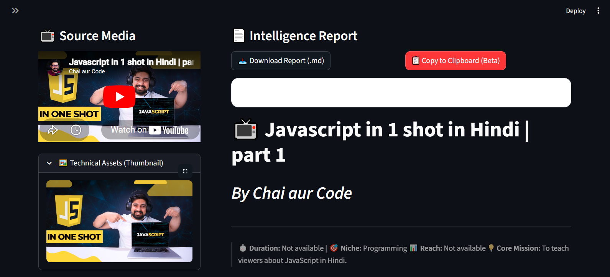
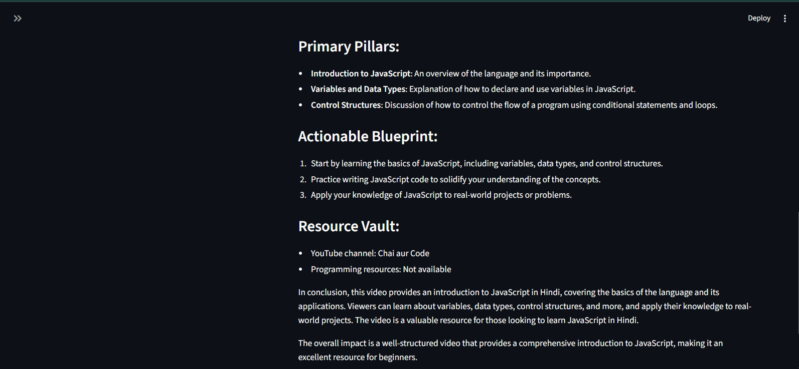

<div align="center">

<!-- Animated Banner -->


<!-- Badges Row 1 -->
<p>
  
  
  
  
</p>

<!-- Badges Row 2 -->
<p>
  
  
  
  
</p>

<br/>

> ### 🎯 Transform any YouTube video into a **structured, scannable Intelligence Report** in seconds — powered by LLaMA 3.3 70B & the Groq Inference Engine.

<br/>

</div>

---

## 📸 Preview

<div align="center">

| 🖥️ Dashboard | 📄 Intelligence Report |
|:---:|:---:|
|  |  |

</div>

---

## ✨ Features

<table>
  <tr>
    <td>🧠 <b>AI Intelligence Reports</b></td>
    <td>Converts raw transcripts into structured, professional reports with timelines, insights, and action plans</td>
  </tr>
  <tr>
    <td>⚡ <b>Groq-Powered Speed</b></td>
    <td>Uses the ultra-fast Groq inference engine running LLaMA 3.3 70B Versatile for near-instant generation</td>
  </tr>
  <tr>
    <td>📊 <b>Interactive Timeline</b></td>
    <td>Auto-generates a timestamped segment table with topics, key insights, and value tags</td>
  </tr>
  <tr>
    <td>📥 <b>Downloadable Reports</b></td>
    <td>Export your Intelligence Report as a <code>.md</code> file with one click</td>
  </tr>
  <tr>
    <td>🎨 <b>Premium Dashboard UI</b></td>
    <td>Custom-styled Streamlit interface with sidebar controls, media preview, and thumbnail viewer</td>
  </tr>
  <tr>
    <td>🔍 <b>Deep Dive Analysis</b></td>
    <td>Extracts primary pillars, actionable blueprints, and a curated resource vault from any video</td>
  </tr>
  <tr>
    <td>🐛 <b>Debug Mode</b></td>
    <td>Built-in toggle for developer-level debug logs during analysis</td>
  </tr>
</table>

---

## 🏗️ Architecture

```
VideoIntel Pro
├── 🖥️  ui.py                  → Streamlit dashboard & user interface
├── 🤖  Youtube_Analyzer.py    → Agno Agent + Groq model + YouTubeTools
├── 🔐  .env                   → API keys (Groq)
└── 📦  requirements.txt       → Project dependencies
```

```
User Input (YouTube URL)
        │
        ▼
  ┌──────────────┐
  │  Streamlit   │   ← Clean dashboard, sidebar controls
  │    UI (ui.py)│
  └──────┬───────┘
         │
         ▼
  ┌───────────────────┐
  │  YouTube Agent    │   ← Agno Agent Framework
  │  (agno + Groq)    │
  └──────┬────────────┘
         │
    ┌────┴────┐
    │         │
    ▼         ▼
YouTubeTools  LLaMA 3.3 70B
(Transcript)  (via Groq API)
         │
         ▼
  📄 Intelligence Report
```

---

## 🚀 Getting Started

### Prerequisites

- Python **3.10+**
- A **Groq API Key** → [Get it free at console.groq.com](https://console.groq.com)

### 1️⃣ Clone the Repository

```bash
git clone https://github.com/saifullah857/youtube_analyzer-agent

```

### 2️⃣ Create a Virtual Environment

```bash
python -m venv venv

# Activate on Windows
venv\Scripts\activate

# Activate on macOS/Linux
source venv/bin/activate
```

### 3️⃣ Install Dependencies

```bash
pip install -r requirements.txt
```

### 4️⃣ Configure Environment Variables

Create a `.env` file in the project root:

```env
GROQ_API_KEY=your_groq_api_key_here
```

> ⚠️ **Never commit your `.env` file.** It is already listed in `.gitignore`.

### 5️⃣ Launch the Application

```bash
streamlit run ui.py
```

Open your browser at **`http://localhost:8501`** and paste any YouTube URL. 🎉

---

## 📦 Dependencies

| Package | Purpose |
|:---|:---|
| `streamlit` | Web UI framework |
| `agno` | AI Agent orchestration framework |
| `groq` | Groq API client for LLaMA inference |
| `python-dotenv` | Secure environment variable loading |
| `youtube-transcript-api` | Fetching YouTube subtitles/transcripts |

---

## 📄 Report Structure

Every Intelligence Report follows a strict, professional architecture:

```
# 📺 [Video Title]
## By [Channel Name]
---

> ⏱️ Duration | 🎯 Niche | 📊 Reach | 💡 Core Mission

---

| 🕒 Time | 🚀 Segment Topic | 💡 Key Insight | ✨ Value |

---

🧠 Deep Dive Intelligence
  ├── Primary Pillars
  ├── Actionable Blueprint
  └── Resource Vault

🎯 Final Summary
```

---

## ⚙️ Configuration

You can customize the agent's behavior in `Youtube_Analyzer.py`:

| Parameter | Default | Description |
|:---|:---|:---|
| `model` | `llama-3.3-70b-versatile` | Groq model to use |
| `markdown` | `True` | Enable markdown formatting in response |
| `add_datetime_to_context` | `True` | Injects current timestamp into agent context |

---

## 🛡️ Environment Variables

| Variable | Required | Description |
|:---|:---:|:---|
| `GROQ_API_KEY` | ✅ | Your Groq Cloud API key |

---

## 🤝 Contributing

Contributions are welcome and appreciated! Here's how you can help:

1. **Fork** this repository
2. **Create** your feature branch: `git checkout -b feature/AmazingFeature`
3. **Commit** your changes: `git commit -m 'Add AmazingFeature'`
4. **Push** to the branch: `git push origin feature/AmazingFeature`
5. **Open** a Pull Request

Please ensure your code follows the existing style and includes appropriate comments.

---

## 📋 Roadmap

- [x] Core transcript extraction & AI report generation
- [x] Streamlit dashboard with download support
- [x] Debug mode toggle
- [ ] Multi-video batch analysis
- [ ] Support for playlists
- [ ] Chat with video transcript
- [ ] Export reports as PDF
- [ ] Multilingual transcript support

---

## ⚠️ Known Limitations

- The video **must have subtitles/captions** enabled (auto-generated or manual)
- Private or age-restricted videos cannot be analyzed
- Very long videos (3h+) may hit token context limits

---

## 📜 License

```
MIT License — Copyright (c) 2025

Permission is hereby granted, free of charge, to any person obtaining a copy
of this software to use, copy, modify, merge, publish, distribute, sublicense,
and/or sell copies of the Software.
```

See the full [LICENSE](LICENSE) file for details.

---

<div align="center">

<!-- Footer Wave -->


<br/>

**Built with ❤️ using Groq · LLaMA 3.3 · Agno · Streamlit**

<br/>


&nbsp;

&nbsp;


<br/><br/>

⭐ **Star this repo if you found it useful!** ⭐

</div>